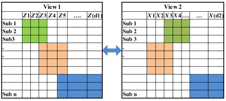
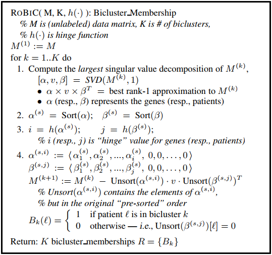

# Notes On Multi-View Clustering With Co-Training

## A subspace co-training framework for multi-view clustering

 The objective of this papter is to employ co-training algorithms to achieve consensus among divergent perspectives. The core idea is described as following,

- To train an LDA model for view $a$ using label information from another view $b$, and perform transformation by the projection matrix obtained by the LDA model. The method uses $X^{(v)}$ and $H^{(3-v)}$ (label from another view) to train LDA projection matrix $P^{(v)}$, and project all samples into a new representation guided by the matrix  $P^{(v)}$.

- Updating a new assignment for each item in the view $a$. to perform k-means clustering on projected samples with initialized k-centers $S^{(v)}$. then update label information $H^{(v)}$ and new k-centers $S^{(v)}$.

Firstly, the authors defined a criterion for evaluating the degree of consensus, i.e.,

$$
\textrm{CAI}(\pmb{H}^{(1)},\pmb{H}^{(2)})\triangleq \frac1n \sum_{i=1}^n \delta (h_i^{(1)},\textrm{map}(h_i^{(2)}))
$$

Then, the mothod seeks two LDA projections $\pmb{P}^{(1)},\pmb{P}^{(2)}$ such that the CAI resulting from k-means on both subspaces is maximized.

$$
\arg\max\limits_{\pmb{P}^{(1)},\pmb{P}^{(2)}} \textrm{CAI}(\pmb{H}^{(1)},\pmb{H}^{(2)})
$$

where $\pmb{H}^{(v)}$ are further dependent on $\pmb{P}^{(v)}$,

$$
H^{(v)}=\arg\min\limits_{H^{(v)}}\sum_{k=1}^K\sum_{h_i^{(v)}=k}\Vert P^{(v)\top}\pmb{x}_i - P^{(v)\top}\pmb{m}_k\Vert^2;\quad (v=1,2)
$$

The training process of CoKmLDA is showed in the figure below. By incorporating the Co-training strategy, the algorithm use cluster indicators generated by $k$-means in one view as supervised label information to train LDA projections in the other view, and vise versa.

### Questions

- **advantages**. not complicated.

- **defects**.  

  - It is difficult for the algorithm to reach a balance between all views when the number of views exceeds three. The convergence of the algorithm is not guaranteed.

### Future Work

### References

- [Zhao2014] Xuran Zhao, Nicholas Evans, Jean-Luc Dugelay. *A subspace co-training framework for multi-view clustering*. **Pattern Recognition Letters**, 2014.

## Multi-view sparse co-clustering via proximal alternating linearized minimization

By taking advantage of the low-rank approximation, Sun et al.  proposed a sparse co-clustering approach in which multiple data matrices are simultaneously decomposed into products of sparse row and column vectors. The method performs biclustering in each view to identify row clusters and column clusters with the constraint  that row clusters should be the same across views.

The core idea of sparse co-clustering is described as follow,

The optimization problem of the paper is defined as,

$$
  \begin{split}
     \min\limits_{\pmb{\omega},\pmb{u}^{k},\pmb{v}^k}&\sum_{k=1}^{m}\left\Vert \pmb{X}^k-\textrm{diag}(\pmb{\omega})\pmb{u}^{k}\pmb{v}^{k\top}\right\Vert_F^2\\
     \textrm{s.t.}\quad &\Vert\pmb{\omega}\Vert_0\le s_{\omega},\Vert\pmb{v}^k\Vert_0\le s_{v^k}
  \end{split}
$$

The authors utilize proximal alternating linearized minimization (PALM) to solve this problem. The main idea of PALM is to, for each block of variables, perform one gradient step on the smooth part, while a proximal step is taken on the non-smooth part. PALM only requires componentwise Lipchitz continuity, i.e., Lipchitz continuous w.r.t. a block of variables when others are fixed.

### Questions

Is there any overlap between BiClusters? If we want the BiCluster algorithm to obtain overlapping BiClusters, it is easy to obtain overlapping clusters by performing SSVD and replacing the data matrix $X$ with a new version $X-\sigma\pmb{u}\pmb{v}^\top$. Otherwise, to get non-overlapping clusters, the algorithm should use another version $X$ that removes the rows of clustered subjects in the last round. The process of generating $K$ BiClusters is discribed in RoBIC\cite{Asgarian2007} as follow,

- In comparison to SSVD\cite{Lee2010}, the most significant difference is the solution strategy, which uses PALM to iteratively solve the optimization problem (old problem new method).

- However, some problems related to BiClusters are still unresolved, such as "will the algorithm output how many biclusters? if the parameter $k$ exceeds the rank of data matrix".

- Besides, there maybe exists some relations with recommender system, such as group recommendation with biClusters?

### Future work

- The global and local structural information could be used to regularize the other clustering algorithms, such as fuzzy c-means, spectral clustering et al.

- A work could be done for"\textit{Projected fuzzy c-means with global and local structural information preserving}". However, the title above should be edited to have less overlap in words.