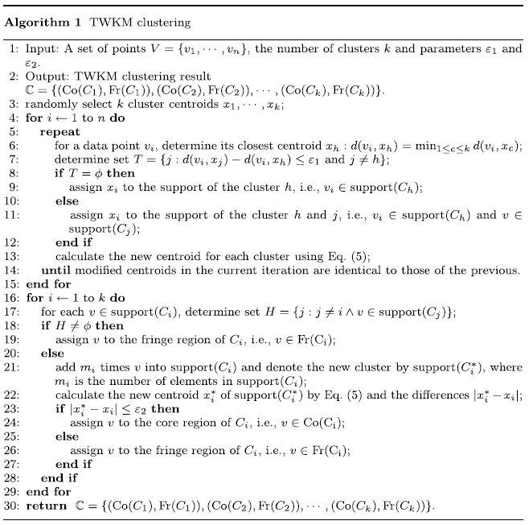

# 三支决策论文笔记

## Notes on Three-way clustering: Foundations, survey and challenges

&emsp;&emsp;该篇论文要是聚焦在三支决策聚类。总结了该领域的研究进展。

### Mian Idea

&emsp;&emsp;**三支聚类**. 假设有数据集$U=\{\pmb{x}_1,...,\pmb{x}_n\}$，三支聚类指是任意聚类簇$C_i$可以表示为核心域$\textrm{Co}(C_i)$和边界域$\textrm{Fr}(C_i)$，即，$C_t=\{\textrm{Co}(C_i),\textrm{Fr}(C_t)\}$，且满足以下条件：
1. $\textrm{Co}(C_t)\neq \emptyset, t=1,2,...,k$,
2. $\textrm{Co}(C_t)\cap \textrm{Fr}(C_t)=\emptyset$,
3. $\bigcup_{i=1}^k [\textrm{Co}(C_t)] \cup [\textrm{Fr}(C_t)]=U$.

&emsp;&emsp;对于类簇$C_i$，全体样本$U$可以分解为$\textrm{Co}(C_i)$、$\textrm{Fr}(C_i)$以及$\textrm{Tr}(C_t)=U-\textrm{Co}(C_i)-\textrm{Fr}(C_i)$三个子集。并且这些子集满足：
1. $\textrm{Co}(C_t)\cap \textrm{Fr}(C_t)=\emptyset$,
2. $\textrm{Co}(C_t)\cap \textrm{Tr}(C_t)=\emptyset$,
3. $\textrm{Fr}(C_t)\cap \textrm{Tr}(C_t)=\emptyset$,
4. $\textrm{Tr}(C_t)\cup \textrm{Co}(C_t)\cup \textrm{Fr}(C_t)=U$.

- **三支硬聚类**

&emsp;&emsp;主要的诉求为所有类簇$C=\{(\textrm{Co}(C_1),\textrm{Fr}(C_1)),(\textrm{Co}(C_2),\textrm{Fr}(C_2)),...,(\textrm{Co}(C_k),\textrm{Fr}(C_k))\}$互不相容，即

$$
\forall i,j,i\neq j,\quad \textrm{Co}(C_i)\cap \textrm{Co}(C_j)=\emptyset,\quad \textrm{Co}(C_i)\cap \textrm{Fr}(C_j)=\emptyset,\quad \textrm{Fr}(C_i)\cap \textrm{Fr}(C_j)=\emptyset
$$

- **三支重叠聚类**

&emsp;&emsp;主要的诉求为所有类簇$C=\{(\textrm{Co}(C_1),\textrm{Fr}(C_1)),(\textrm{Co}(C_2),\textrm{Fr}(C_2)),...,(\textrm{Co}(C_k),\textrm{Fr}(C_k))\}$满足以下条件之一

$$
\forall i,j,i\neq j,\quad |\textrm{Co}(C_i)\cap \textrm{Co}(C_j)|\ge 0,\quad |\textrm{Co}(C_i)\cap \textrm{Fr}(C_j)|\ge 0,\quad |\textrm{Fr}(C_i)\cap \textrm{Fr}(C_j)|\ge 0
$$

#### Rough k-means

&emsp;&emsp;Rough k-means (RKM): k-means的修改版，加入了根据类簇上下近似集后修改的类簇的**聚类中心判定规则**：

$$
\pmb{v}_i = \left\{ \begin{array}{ll} A_i=\mu(\underline{\textrm{apr}}(C_i)),& \underline{\textrm{apr}}(C_i)\neq\emptyset;\\
B_i=\mu(\overline{\textrm{apr}}(C_i)-\underline{\textrm{apr}}(C_i)),& \overline{\textrm{apr}}(C_i)-\underline{\textrm{apr}}(C_i)\neq \emptyset;\\
w_lA_i+w_uB_i,& \textrm{otherwise.}
\end{array}\right.
$$(rkm-cluster-center)

其中，$\mu(\cdot)$是集合元素的均值函数。

&emsp;&emsp;k-means的迭代过程中，**样本归于类簇的规则**为，令

$$
T=\{j|d(\pmb{v}_j,\pmb{x}_k)-d(\pmb{v}_p,\pmb{x}_k)\le\Delta, (p\neq j)\}
$$(rkm-candidate-centers)

其中$\Delta$为阈值，$p=\min\limits_{1\ge j\ge k} d(\pmb{v}_j,\pmb{x}_k)$为样本$\pmb{x}_k$最近的类簇编号。样本类簇关系判定规则如下，

1. 如果$T=\emptyset$，则$\pmb{x}_k\Rightarrow \underline{\textrm{apr}}(C_p)$且$\pmb{x}_k\Rightarrow \overline{\textrm{apr}}(C_p)$;
2. 如果$T\neq \emptyset$，$\pmb{x}_k\Rightarrow \overline{\textrm{apr}}(C_p)$且$\pmb{x}_k\Rightarrow \overline{\textrm{apr}}(C_j),\forall j\in T.$

#### TWKM

:::{figure-md}
{width=400px}

TWKM算法[^wang-twkm]
:::

&emsp;&emsp;该算法首先用RKM得到所有类簇的支持集（即上下近似集的和）以及聚类中心，然后将每个类簇的支持集样本分为两类：
- 类型1：样本至少属于2个类簇
- 类型2：样本只属于1个类簇

&emsp;&emsp;对于类型1样本$v$，加入类簇$C_i$的边缘集$Fr(C_i)$，对于类型2样本$v$，将样本$v$与$|C_i|$相乘后加入$C_i$的支持集，然后重新计算$C_i$的聚类中心。如果样本与聚类中心的距离超过阈值$\epsilon_2$则样本加入边缘集$Fr(C_i)$，否则加入核心集$Co(C_i)$。

### Comparison with other papers

### Own idea

问题1： 核心集与边缘集的区分依赖事先给定的阈值。

[^wang-twkm]: Wang, P., Shi, H., Yang, X. and Mi, J. (2019), 'Three-way k-means: integrating k-means and three-way decision', International Journal of Machine Learning and Cybernetics 10(10), 2767--2777. 
